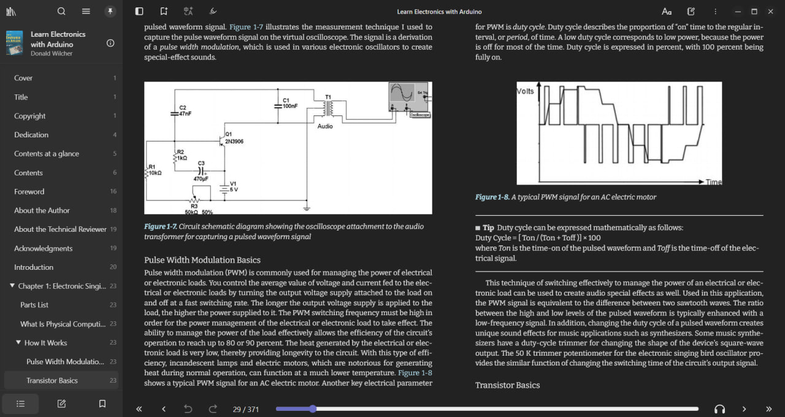
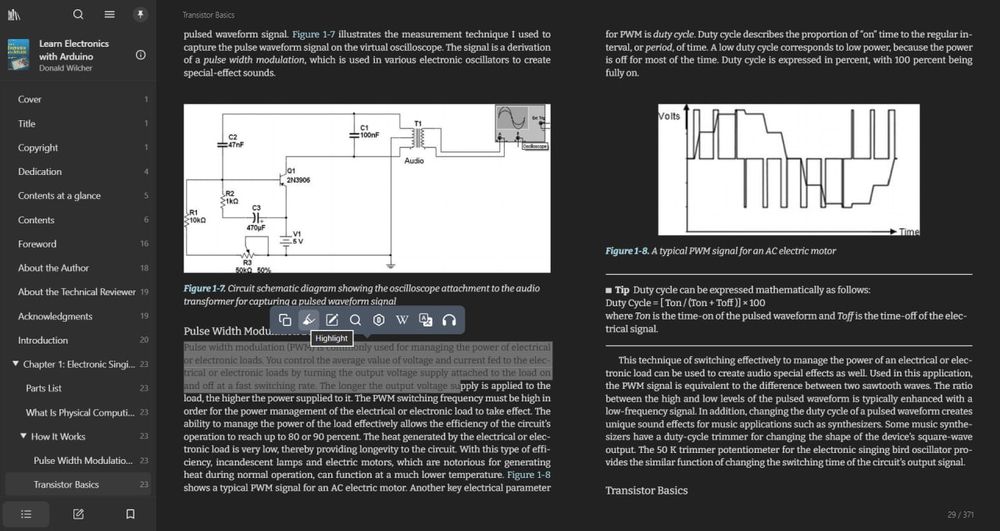
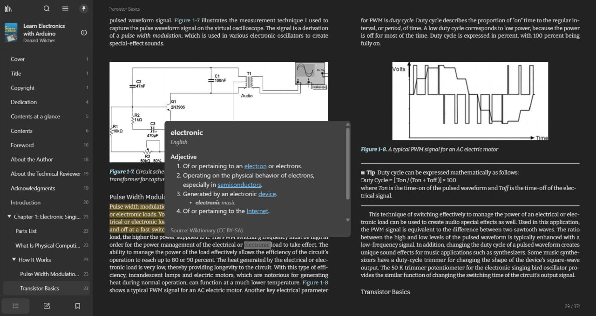
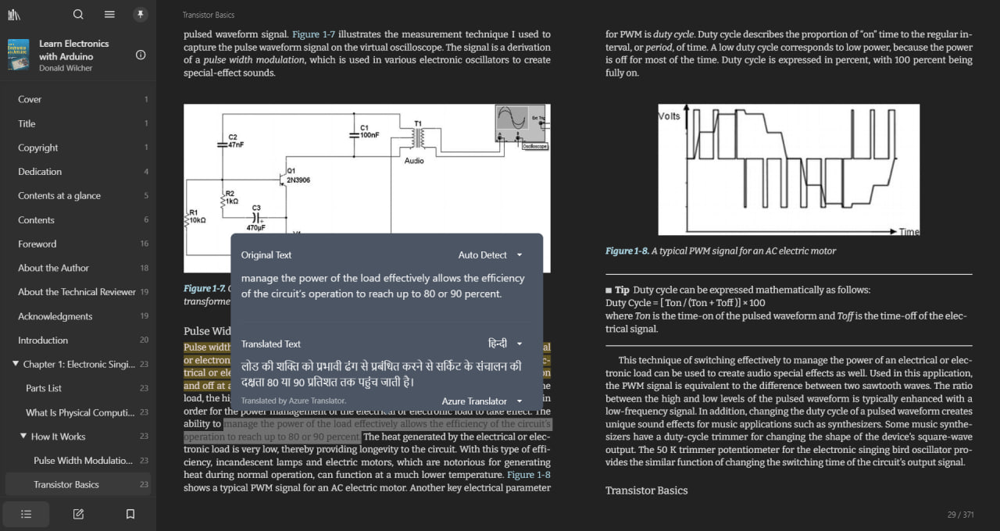

# hackxindia26

A comprehensive cross-platform document reader application built for HackXIndia 2026 under the Education theme.

## Project Overview

hackxindia26 is a modern document reader designed to enhance the reading and learning experience for students and educators across India. The application supports multiple document formats and provides advanced features for annotation, translation, and text-to-speech, making education more accessible and interactive.

## Screenshots









## Supported Formats

The application supports a wide range of document and ebook formats:

- EPUB
- PDF
- MOBI and AZW3 (Kindle formats)
- TXT and MD (Plain text and Markdown)

## Key Features

### Reading Experience

- Clean and distraction-free reading interface
- Support for both reflowable and fixed-layout documents
- Customizable reading settings including font size, spacing, and justification
- Day and night reading modes
- Vertical and horizontal reading orientations
- Table of contents navigation

### Annotation and Note-Taking

- Text highlighting with multiple colors and styles
- Add notes and annotations to selected text
- Bookmark important pages
- Export annotations to Markdown format
- Search through your notes and highlights

### Learning Tools

- Built-in dictionary lookup (Wiktionary integration)
- Wikipedia integration for quick reference
- Text-to-speech functionality for audio learning
- Translation support for multiple languages
- Hindi text conversion support (Traditional/Simplified)
- In-document text search

### Library Management

- Organize books in a personal library
- Track reading progress
- View reading statistics and time estimates
- Import and manage multiple documents
- Cloud synchronization support

### Cross-Platform Support

- Desktop applications for Windows, macOS, and Linux
- Progressive Web App (PWA) for web browsers
- Mobile support for iOS and Android
- Offline-first architecture for uninterrupted access

## Technical Stack

### Frontend

- **Framework**: Next.js 16 with React 19
- **Language**: TypeScript
- **Styling**: Tailwind CSS with DaisyUI components
- **State Management**: Zustand
- **Internationalization**: i18next with support for multiple languages

### Desktop Application

- **Framework**: Tauri 2.9
- **Backend**: Rust
- **Platform**: Cross-platform native applications

### Document Rendering

- **EPUB Renderer**: foliate-js (custom implementation)
- **PDF Support**: PDF.js
- **File Handling**: @zip.js/zip.js for archive formats

### Additional Features

- **Authentication**: Supabase
- **Analytics**: PostHog
- **Service Worker**: Serwist for offline functionality
- **Testing**: Vitest with React Testing Library

## Building and Running

### Prerequisites

- Node.js (v22 or higher)
- pnpm package manager
- Rust toolchain (for desktop builds)
- Visual Studio 2022 or higher tools

### Development Setup

```bash
# Install dependencies
pnpm install

# Setup required vendors
pnpm setup-vendors

# Run web version
pnpm dev-web

# Run desktop version
pnpm tauri dev
```

### Building for Production

```bash
# Build web version
pnpm build-web

# Build Windows application
pnpm build-win-x64

# Build macOS application
pnpm build-macos-universial

# Build Linux application
pnpm build-linux-x64
```

## Education Theme Alignment

This project addresses key challenges in the Indian education sector:

1. **Accessibility**: Supports multiple languages and includes text-to-speech for students with different learning needs.

2. **Affordability**: Open-source solution that works on various platforms, reducing the need for expensive proprietary software.

3. **Enhanced Learning**: Integrated dictionary, Wikipedia lookup, and translation tools help students learn independently.

4. **Offline Support**: Works without continuous internet connectivity, crucial for students in areas with limited internet access.

5. **Note-Taking and Annotation**: Helps students actively engage with educational content through highlights and notes.

## HackXIndia 2026

This project was developed for HackXIndia, a 24-hour hackathon bringing together developers, designers, and innovators from across India to build solutions for real-world problems.

- **Theme**: Education - Open Bharat
- **Duration**: January 20-21, 2026
- **Mode**: Online

The goal was to create technology that makes education more accessible and effective for students across India, regardless of their location or resources.

## License

This project builds upon several open-source components. Please refer to individual package licenses for more details.

## Contact

For queries and support, please open an issue in the project repository.
